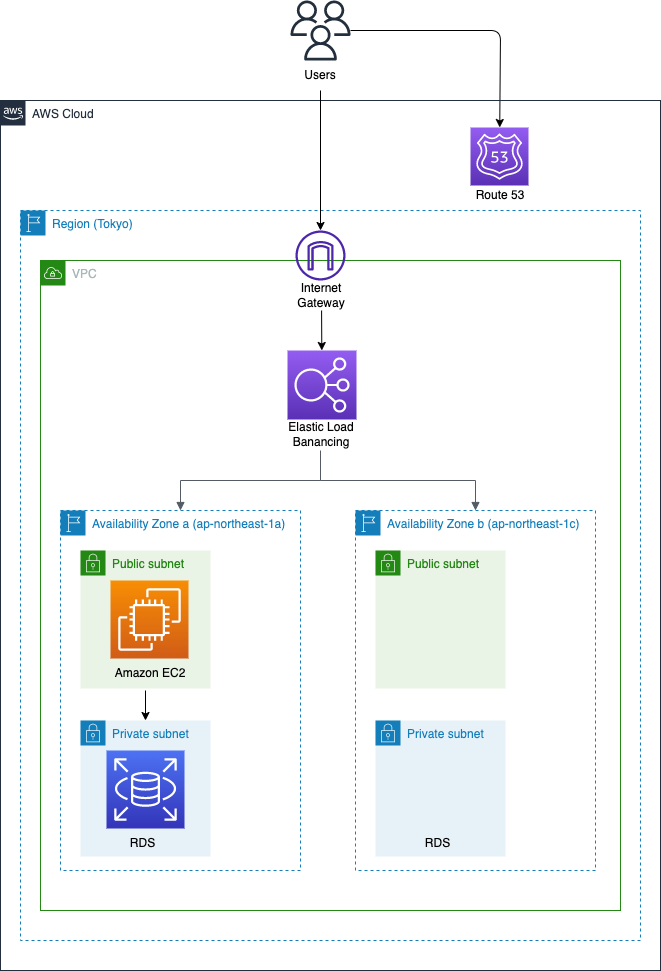

# RealWorld

## 概要
AWS/Web学習用のリポジトリです。

課題として、[RealWorld の バックエンドの API](https://realworld-docs.netlify.app/docs/specs/backend-specs/introduction) をAWS上にデプロイします。

### ステップ1

RealWorld のバックエンドの API を AWS 上にデプロイしてください。デプロイする際には、次の要件を満たすようにしてください。

- 各エンドポイントに対してリクエストを送ると、正しいレスポンスが返ってくること
- API サーバー (EC2 もしくは ECS) とデータベースサーバー (RDS) は別々に構築すること
- データベースサーバーは、API サーバーからのみアクセスできるようにすること
- 独自ドメインでアクセスできるようにすること
- SSL 化 (HTTPS 化) すること

### ステップ2

構築したシステムを、インフラ構成図 (AWS のアーキテクチャ図) として draw.io などを用いて描いてください。描いたインフラ構成図は GitHub のリポジトリ の README もしくは documents ディレクトリにアップしてください。

## 課題アウトプット

### ステップ1

[独自ドメイン](https://nk-jobboard.xyz)

※実装したエンドポイントは次の通りです。
- [Registration](https://realworld-docs.netlify.app/docs/specs/backend-specs/endpoints#registration)
- [Authentication](https://realworld-docs.netlify.app/docs/specs/backend-specs/endpoints#authentication)
- [Create Article](https://realworld-docs.netlify.app/docs/specs/backend-specs/endpoints#create-article)
- [Get Article](https://realworld-docs.netlify.app/docs/specs/backend-specs/endpoints#get-article)
- [Update Article](https://realworld-docs.netlify.app/docs/specs/backend-specs/endpoints#update-article)
- [Delete Article](https://realworld-docs.netlify.app/docs/specs/backend-specs/endpoints#delete-article)

このうち、Registration及びAuthenticationはスペック通り挙動することが確認できましたが、他のエンドポイントについては、スペック通り挙動しません。開発環境では上記エンドポイントの全てのテストは通っています。スペック通り挙動しない原因については引き続き調査します。

### ステップ2

### 文責
- 小木曽 将弘
